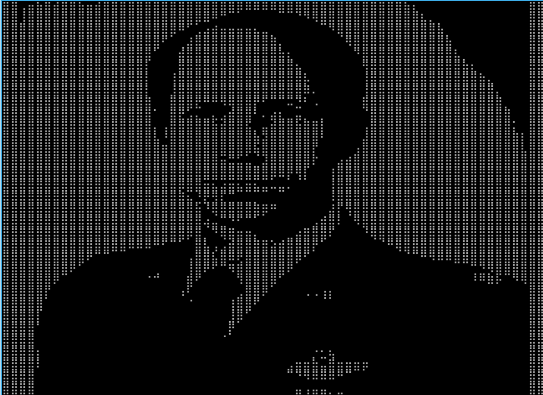
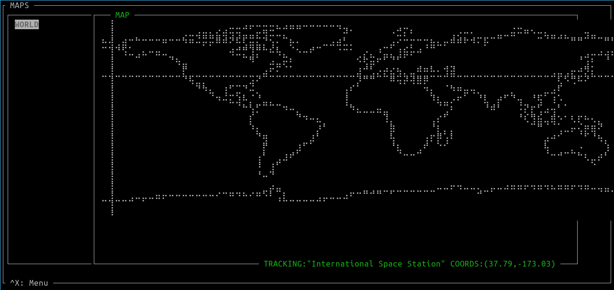
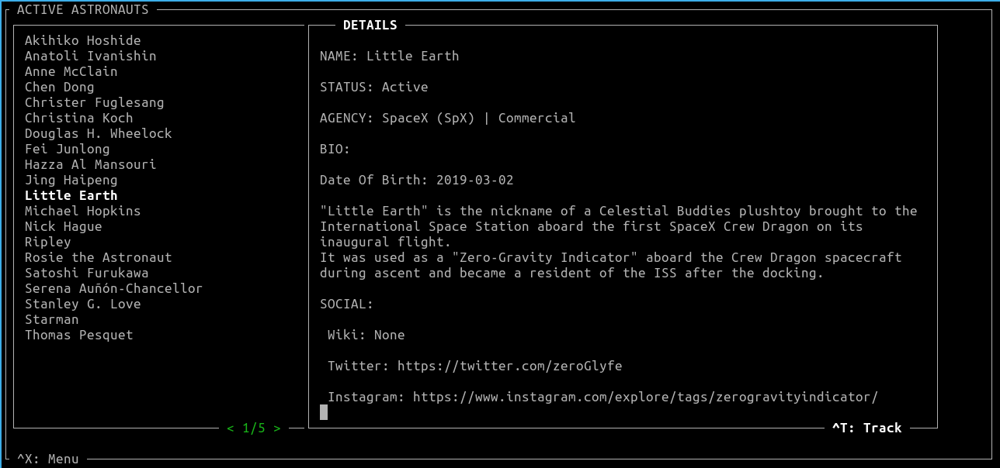
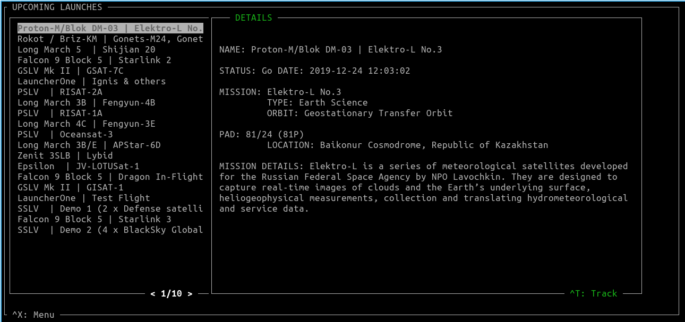
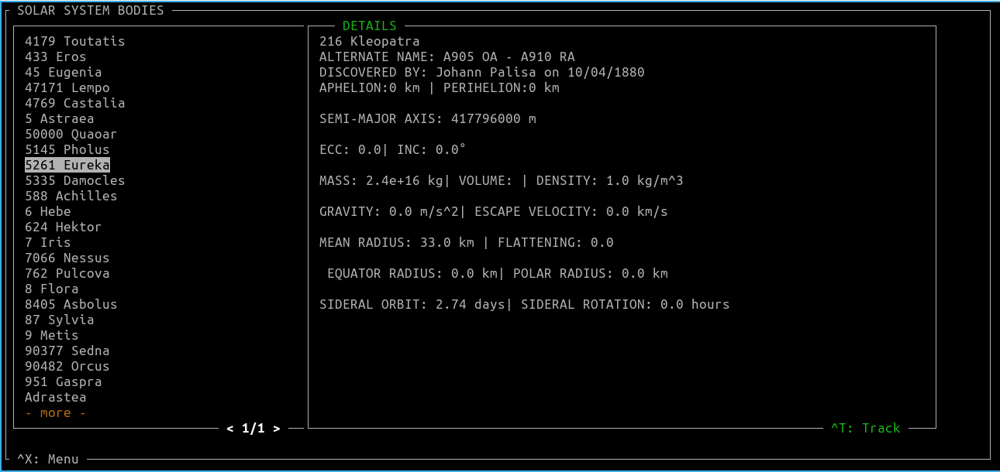

# PROJECT WORDEN - Terminal Based Space Display 

Pictured, the epynomous Alfred Worden (the only astronaut I had the privilege to meet in person)

## Screenshots

## Goal
Aggregate information from several Space-related APIs into a single, cohesive and (hopefully) cool-looking terminal based interface

## Features
### Upcoming launches
See available information for the upcoming launches of spacecraft
### Active Astronauts
Displays a list of all known, active astronauts
### Maps & Tracking
Displays the world maps and rough position of trackable objects
### Astral bodies in the solar system
See all (?) known astral bodies of the solar system, as well as relevant orbital parameters.

## Used APIs
https://spacelaunchnow.me/api/3.3.0/
https://open-notify.org/
https://api.le-systeme-solaire.net/swagger/#/bodies/get_bodies

### Future features/wishlist
* Orbital Map [Future]
* Solar System Map [Future]
* list of tracked objects displayed on the maps
* correlation between data types
* Open links in the details
#### Candidate APIs (for future developments)
* https://www.n2yo.com/api/
* https://celestrak.com/